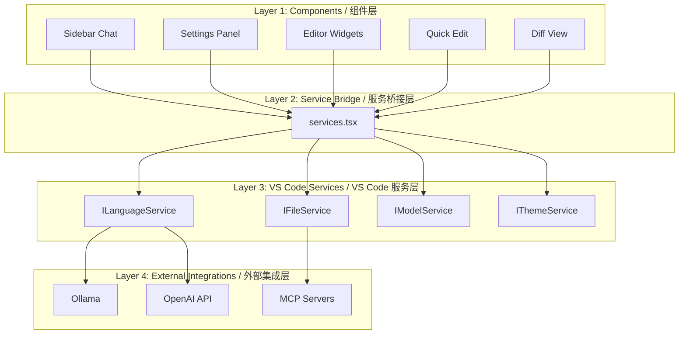
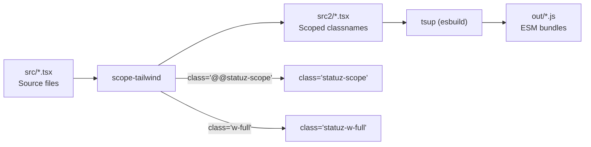

# 架构文档

> **文档性质**：本文档描述 Statuz IDE 的**现有代码架构**。所有声明均基于对代码库的直接验证，附带精确的 `file:line` 引用。若某项信息暂时无法验证，将明确标注 "未验证"。

---

## 高层架构

Statuz IDE 由 4 个层级组成，从用户交互到 VS Code 核心逐步深入。



### 核心设计公式

```
Statuz IDE = VS Code (Shell + Editor) + Statuz (Sidebar AI)
```

所有 Statuz 代码位于 `src/vs/workbench/contrib/statuz/`，不修改 VS Code 核心。

---

## 目录结构

```
src/vs/workbench/contrib/statuz/
├── browser/                           # Browser-side code / 浏览器端代码
│   ├── react/                         # React build system / React 构建系统
│   │   ├── src/                       # Source TSX files / 源码
│   │   │   ├── sidebar-tsx/           # Sidebar components
│   │   │   ├── statuz-settings-tsx/   # Settings panel
│   │   │   ├── statuz-editor-widgets-tsx/  # Editor widgets
│   │   │   ├── quick-edit-tsx/        # Quick edit
│   │   │   ├── statuz-onboarding/     # Onboarding flow
│   │   │   ├── statuz-tooltip/        # Tooltip system
│   │   │   ├── diff/                  # Diff view
│   │   │   └── util/                  # Utility hooks and services bridge
│   │   ├── src2/                      # Generated by scope-tailwind / 由 scope-tailwind 生成
│   │   ├── out/                       # Bundled ESM output / ESM 打包输出
│   │   ├── styles.css                 # CSS variables and Tailwind directives
│   │   ├── tsup.config.js             # tsup bundler config
│   │   └── build.js                   # Build script (scope-tailwind + tsup)
│   ├── chatThreadService.ts           # Chat thread state management
│   ├── editCodeService.ts             # Code editing operations
│   ├── sidebarPane.ts                 # VS Code ViewPane registration
│   ├── sidebarActions.ts              # VS Code action registrations
│   └── ...
├── common/                            # Shared code / 共享代码
│   ├── statuzSettingsService.ts       # Settings state
│   ├── sendLLMMessageService.ts       # LLM message interface
│   ├── mcpService.ts                  # MCP protocol
│   ├── engine/                        # Native engine service
│   └── ...
├── electron-main/                     # Main process code / 主进程代码
│   ├── llmMessage/                    # LLM message implementation
│   ├── statuzUpdateMainService.ts     # Auto-update logic
│   └── ...
└── test/                              # Tests
```

**关于 `src2/` 的重要说明**：`src2/` 是由 `scope-tailwind` 生成的目录，将 `src/` 中的文件复制过来并对 Tailwind 类名添加作用域前缀。`browser/react/.gitignore` 已排除 `src2/` 和 `out/`，但本地 `src2/` 中仍存在旧生成的文件，文件名包含 "Void"（如 `VoidCommandBar.tsx`）。执行 `node build.js` 前应删除 `src2/` 和 `out/` 以确保生成结果与当前 `src/` 一致。

---

## Sidebar 组件层次

### Sidebar.tsx

**位置**：`src/vs/workbench/contrib/statuz/browser/react/src/sidebar-tsx/Sidebar.tsx`

```tsx
export const Sidebar = ({ className }: { className: string }) => {
    const isDark = useIsDark()
    return <div
        className={`@@statuz-scope ${isDark ? 'dark' : ''}`}
        style={{ width: '100%', height: '100%' }}
    >
        <div className={`w-full h-full bg-statuz-bg-2 text-statuz-fg-1`}>
            <div className={`w-full h-full`}>
                <ErrorBoundary>
                    <SidebarChat />
                </ErrorBoundary>
            </div>
        </div>
    </div>
}
```

**说明**：`Sidebar` 是根组件，负责应用 Tailwind 作用域和 VS Code 主题变量。当前仅渲染 `SidebarChat`，不包含 Tab 切换或 Board 视图。

### VS Code ViewPane 挂载流程

**位置**：`src/vs/workbench/contrib/statuz/browser/sidebarPane.ts:75-86`

```typescript
protected override renderBody(parent: HTMLElement): void {
    super.renderBody(parent);
    parent.style.userSelect = 'text'

    this.instantiationService.invokeFunction(accessor => {
        const disposeFn: (() => void) | undefined = mountSidebar(parent, accessor)?.dispose;
        this._register(toDisposable(() => disposeFn?.()))
    });
}
```

挂载链：`sidebarPane.ts:83` 调用 `mountSidebar` → `mountSidebar` 调用 `ReactDOM.createRoot` → 渲染 `<Sidebar />` 组件。

---

## VS Code ViewPane 系统

### ViewContainer 注册

**位置**：`src/vs/workbench/contrib/statuz/browser/sidebarPane.ts:104-123`

```typescript
export const STATUZ_VIEW_CONTAINER_ID = 'workbench.view.void'
export const STATUZ_VIEW_ID = STATUZ_VIEW_CONTAINER_ID

const viewContainerRegistry = Registry.as<IViewContainersRegistry>(ViewContainerExtensions.ViewContainersRegistry);
const container = viewContainerRegistry.registerViewContainer({
    id: STATUZ_VIEW_CONTAINER_ID,
    title: nls.localize2('statuzContainer', 'Chat'), // this is used to say "Void" (Ctrl + L)
    ctorDescriptor: new SyncDescriptor(ViewPaneContainer, [STATUZ_VIEW_CONTAINER_ID, {
        mergeViewWithContainerWhenSingleView: true,
        orientation: Orientation.HORIZONTAL,
    }]),
    hideIfEmpty: false,
    order: 1,
    rejectAddedViews: true,
    icon: Codicon.symbolMethod,
}, ViewContainerLocation.AuxiliaryBar, { doNotRegisterOpenCommand: true, isDefault: true });
```

**关键参数**：

| 参数 | 值 | 说明 |
|------|-----|------|
| `id` | `workbench.view.void` | ViewContainer ID（品牌残留，见 `BRAND_DEBT.md` C2） |
| `title` | `'Chat'` | 显示标题 |
| `location` | `AuxiliaryBar` | 右侧边栏 |
| `mergeViewWithContainerWhenSingleView` | `true` | 单视图时合并标题栏 |
| `orientation` | `Orientation.HORIZONTAL` | 水平方向 |
| `hideIfEmpty` | `false` | 空时也显示 |
| `rejectAddedViews` | `true` | 禁止其他扩展加入 |
| `canToggleVisibility` | `false` | 不允许隐藏 |
| `canMoveView` | `false` | 不允许移出 |
| `doNotRegisterOpenCommand` | `true` | 不自动注册打开命令 |
| `isDefault` | `true` | 默认容器 |

### 已注册 Actions

**位置**：`src/vs/workbench/contrib/statuz/browser/sidebarActions.ts` 和 `browser/actionIDs.ts`

| Action ID | 触发方式 | 功能 | 文件位置 |
|-----------|---------|------|---------|
| `void.sidebar.open` | F1 Command Palette | 打开 Sidebar | `sidebarActions.ts:64` |
| `void.ctrlLAction` | `Ctrl+L` | 添加选择到 Chat | `actionIDs.ts:4` |
| `void.ctrlKAction` | `Ctrl+K` | Quick Edit | `actionIDs.ts:6` |
| `void.acceptDiff` | — | 接受 Diff | `actionIDs.ts:8` |
| `void.rejectDiff` | — | 拒绝 Diff | `actionIDs.ts:10` |
| `void.goToNextDiff` | — | 下一个 Diff | `actionIDs.ts:12` |
| `void.goToPrevDiff` | — | 上一个 Diff | `actionIDs.ts:14` |
| `void.goToNextUri` | — | 下一个 URI | `actionIDs.ts:16` |
| `void.goToPrevUri` | — | 上一个 URI | `actionIDs.ts:18` |
| `void.acceptFile` | — | 接受文件 | `actionIDs.ts:20` |
| `void.rejectFile` | — | 拒绝文件 | `actionIDs.ts:22` |
| `void.acceptAllDiffs` | — | 接受所有 Diff | `actionIDs.ts:24` |
| `void.rejectAllDiffs` | — | 拒绝所有 Diff | `actionIDs.ts:26` |
| `void.cmdL` | `Ctrl+L` | 添加选择到 Chat（别名） | `sidebarActions.ts:84` |
| `void.cmdShiftL` | `Ctrl+Shift+L` | 新建聊天 | `sidebarActions.ts:147` |
| `void.historyAction` | ViewTitle menu | 历史聊天 | `sidebarActions.ts:212` |
| `void.settingsAction` | ViewTitle menu | 打开设置 | `sidebarActions.ts:242` |
| `void.openSidebar` | — | 打开 Sidebar（内部） | `sidebarPane.ts:152` |

**注意**：所有 Action ID 仍以 `void.` 为前缀，是品牌残留。详见 `BRAND_DEBT.md` C2。

---

## React 构建系统

### 构建流程



**构建步骤**（`browser/react/build.js:148-151`）：

1. **scope-tailwind**：`npx scope-tailwind ./src -o src2/ -s statuz-scope -c styles.css -p "statuz-"`
   - 将 `src/` 复制到 `src2/`
   - 对所有 Tailwind 类名添加 `statuz-` 前缀（如 `w-full` → `statuz-w-full`）
   - 将 `@@statuz-scope` 替换为 `statuz-scope`
   - **不处理**字符串字面量、data attributes（如 `data-tooltip-id="void-tooltip"`）或组件名

2. **tsup**：`npx tsup`
   - 将 `src2/` 的 TypeScript 打包为 `out/` 的 ESM 模块
   - `injectStyle: true` 将 CSS 内联到 JS 中
   - `noExternal: [ /^(?!\.).*$/ ]` 打包所有 npm 依赖
   - `external: [ /\.\.\/\.\.\/\.\.\/\.\.\/\.\.\/.*\.js$/ ]` 保持 VS Code 模块为外部引用

### tsup 配置

**位置**：`src/vs/workbench/contrib/statuz/browser/react/tsup.config.js`

```javascript
export default defineConfig({
    entry: [
        './src2/statuz-editor-widgets-tsx/index.tsx',
        './src2/sidebar-tsx/index.tsx',
        './src2/statuz-settings-tsx/index.tsx',
        './src2/statuz-tooltip/index.tsx',
        './src2/statuz-onboarding/index.tsx',
        './src2/quick-edit-tsx/index.tsx',
        './src2/diff/index.tsx',
    ],
    outDir: './out',
    format: ['esm'],
    splitting: false,
    clean: false,
    platform: 'browser',
    target: 'esnext',
    injectStyle: true,
    outExtension: () => ({ js: '.js' }),
    noExternal: [ /^(?!\.).*$/ ],
    external: [ new RegExp('../../../../../../*.js'.replaceAll('.', '\\.').replaceAll('*', '.*')) ],
    treeshake: true,
    esbuildOptions(options) {
        options.outbase = 'src2'
    }
})
```

### 构建输出

| 入口点 | 说明 |
|--------|------|
| `out/sidebar-tsx/index.js` | Sidebar 主组件 |
| `out/statuz-settings-tsx/index.js` | 设置面板 |
| `out/statuz-editor-widgets-tsx/index.js` | 编辑器 widgets |
| `out/quick-edit-tsx/index.js` | Quick edit |
| `out/statuz-onboarding/index.js` | Onboarding 流程 |
| `out/statuz-tooltip/index.js` | Tooltip |
| `out/diff/index.js` | Diff 视图 |

### 开发命令

```bash
# 单次构建
cd src/vs/workbench/contrib/statuz/browser/react
node build.js

# 监听模式
node build.js --watch

# 仅类型检查
npx tsc --noEmit
```

---

## 服务注册系统

### 注册流程

**位置**：`src/vs/workbench/contrib/statuz/browser/react/src/util/services.tsx:89-181`

`services.tsx` 桥接 React 组件与 VS Code 服务，使用全局发布-订阅模式：

```typescript
export const _registerServices = (accessor: ServicesAccessor) => {
    const disposables: IDisposable[] = []
    _registerAccessor(accessor)

    const stateServices = {
        chatThreadsStateService: accessor.get(IChatThreadService),
        settingsStateService: accessor.get(IStatuzSettingsService),
        refreshModelService: accessor.get(IRefreshModelService),
        themeService: accessor.get(IThemeService),
        editCodeService: accessor.get(IEditCodeService),
        voidCommandBarService: accessor.get(IStatuzCommandBarService),   // 品牌残留变量名
        modelService: accessor.get(IModelService),
        mcpService: accessor.get(IMCPService),
    }

    // 初始化状态变量并注册监听器...
    chatThreadsState = chatThreadsStateService.state
    disposables.push(chatThreadsStateService.onDidChangeCurrentThread(() => { ... }))

    // ... 其他状态初始化

    return disposables
}
```

### 完整服务清单

**位置**：`src/vs/workbench/contrib/statuz/browser/react/src/util/services.tsx:185-223`

| 服务接口 | 变量名（若适用） | 用途 |
|----------|----------------|------|
| `IModelService` | — | 编辑器 model 管理 |
| `IClipboardService` | — | 剪贴板操作 |
| `IContextViewService` | — | 上下文视图 |
| `IContextMenuService` | — | 上下文菜单 |
| `IFileService` | — | 文件系统 |
| `IHoverService` | — | Hover tooltip |
| `IThemeService` | `themeService` | 主题管理 |
| `ILLMMessageService` | — | LLM 消息发送 |
| `IRefreshModelService` | `refreshModelService` | Model 刷新 |
| `IStatuzSettingsService` | `settingsStateService` | 设置管理 |
| `IEditCodeService` | `editCodeService` | 代码编辑 |
| `IChatThreadService` | `chatThreadsStateService` | Chat 线程状态 |
| `IInstantiationService` | — | 依赖注入 |
| `ICodeEditorService` | — | 代码编辑器 |
| `ICommandService` | — | 命令执行 |
| `IContextKeyService` | — | Context keys |
| `INotificationService` | — | 通知 |
| `IAccessibilityService` | — | 无障碍 |
| `ILanguageConfigurationService` | — | 语言配置 |
| `ILanguageDetectionService` | — | 语言检测 |
| `ILanguageFeaturesService` | — | 语言特性 |
| `IKeybindingService` | — | 键盘快捷键 |
| `ISearchService` | — | 搜索 |
| `IExplorerService` | — | 文件资源管理器 |
| `IEnvironmentService` | — | 环境信息 |
| `IConfigurationService` | — | 配置 |
| `IPathService` | — | 路径服务 |
| `IMetricsService` | — | Metrics |
| `ITerminalToolService` | — | Terminal 工具 |
| `ILanguageService` | — | 语言服务 |
| `IStatuzModelService` | — | Model 管理 |
| `IWorkspaceContextService` | — | Workspace 上下文 |
| `IStatuzCommandBarService` | `voidCommandBarService` | Command bar |
| `INativeHostService` | — | Native host |
| `IToolsService` | — | 工具执行 |
| `IConvertToLLMMessageService` | — | 消息转换 |
| `ITerminalService` | — | Terminal |
| `IExtensionManagementService` | — | 扩展管理 |
| `IExtensionTransferService` | — | 扩展迁移 |
| `IMCPService` | `mcpService` | MCP 协议 |
| `IStorageService` | — | 存储服务 |

**注意**：`IStatuzCommandBarService` 的变量名为 `voidCommandBarService`，是品牌残留。详见 `BRAND_DEBT.md`。

### 添加新服务

要添加新服务（如未来的 `IBoardService`），需要修改 `services.tsx`：

```typescript
// 1. 导入
import { IBoardService } from '../../../../common/boardServiceTypes.js';

// 2. 添加到 getReactAccessor
const reactAccessor = {
    // ... 现有服务
    IBoardService: accessor.get(IBoardService),
} as const

// 3. 在组件中使用
const { get } = useAccessor()
const boardService = get('IBoardService')
const boardData = await boardService.getBoardData()
```

---

## AI 服务层

### 服务清单与状态

| 服务 | 位置 | 状态 |
|------|------|------|
| `IChatThreadService` | `browser/chatThreadService.ts` | 已实现，支持多线程对话 |
| `IEditCodeService` | `browser/editCodeService.ts` | 已实现，支持代码编辑和 Diff |
| `ILLMMessageService` | `common/sendLLMMessageService.ts` | 已实现，支持多种 LLM provider |
| `IMCPService` | `common/mcpService.ts` | 已实现，支持 MCP 协议 |
| `IConvertToLLMMessageService` | `browser/convertToLLMMessageService.ts` | 已实现，消息格式转换 |
| `IStatuzEngineService` | `common/engine/statuzEngineService.ts` | Stub，`_callEngine` 被注释 |

### 状态管理模式

React 组件不直接调用 VS Code 服务，而是通过 `services.tsx` 中的全局状态变量和监听器间接访问：

```typescript
// services.tsx 中的全局状态
let chatThreadsState: ThreadsState
const chatThreadsStateListeners: Set<(s: ThreadsState) => void> = new Set()

// React 组件订阅状态变化
export const useChatThreadsState = () => {
    const [state, setState] = useState(chatThreadsState)
    useEffect(() => {
        chatThreadsStateListeners.add(setState)
        return () => { chatThreadsStateListeners.delete(setState) }
    }, [])
    return state
}
```

### 可用的 React Hooks

| Hook | 来源 | 用途 |
|------|------|------|
| `useAccessor()` | `services.tsx` | 获取 VS Code 服务访问器 |
| `useIsDark()` | `services.tsx` | 检测当前是否为暗色主题 |
| `useChatThreadsState()` | `services.tsx` | 获取聊天线程状态 |
| `useSettingsState()` | `services.tsx` | 获取设置状态 |
| `useRefreshModelState()` | `services.tsx` | 获取模型刷新状态 |
| `useColorTheme()` | `services.tsx` | 获取当前颜色主题 |
| `useActiveURI()` | `services.tsx` | 获取当前活动文件 URI |
| `useCommandBarURI()` | `services.tsx` | 获取 CommandBar 的 URI |
| `useMCPState()` | `services.tsx` | 获取 MCP 状态 |

---

## CSS 变量系统

**位置**：`src/vs/workbench/contrib/statuz/browser/react/src/styles.css`

Statuz 使用 CSS 自定义属性映射到 VS Code 的主题变量，确保与当前主题无缝融合。

### 背景色

| 变量 | VS Code 源变量 | 用途 |
|------|----------------|------|
| `--statuz-bg-1` | `--vscode-input-background` | 输入框背景 |
| `--statuz-bg-1-alt` | `--vscode-badge-background` | Badge 背景 |
| `--statuz-bg-2` | `--vscode-sideBar-background` | Sidebar 主背景 |
| `--statuz-bg-2-alt` | `color-mix(...)` | Sidebar 交替背景 |
| `--statuz-bg-2-hover` | `color-mix(...)` | Sidebar hover 背景 |
| `--statuz-bg-3` | `--vscode-editor-background` | 编辑器背景 |

### 前景色

| 变量 | VS Code 源变量 | 用途 |
|------|----------------|------|
| `--statuz-fg-0` | `color-mix(...)` | 主标题文字 |
| `--statuz-fg-1` | `--vscode-editor-foreground` | 主内容文字 |
| `--statuz-fg-2` | `--vscode-input-foreground` | 输入框文字 |
| `--statuz-fg-3` | `--vscode-input-placeholderForeground` | 占位符文字 |
| `--statuz-fg-4` | `--vscode-list-deemphasizedForeground` | 弱化文字 |

### 边框与强调色

| 变量 | 值 / 源变量 | 用途 |
|------|-------------|------|
| `--statuz-border-1` | `--vscode-commandCenter-activeBorder` | 活跃边框 |
| `--statuz-border-2` | `--vscode-commandCenter-border` | 普通边框 |
| `--statuz-border-3` | `--vscode-commandCenter-inactiveBorder` | 非活跃边框 |
| `--statuz-border-4` | `--vscode-editorGroup-border` | 编辑器组边框 |
| `--statuz-ring-color` | `#007FD4` | Focus ring 颜色 |
| `--statuz-link-color` | `#007FD4` | 链接颜色 |
| `--statuz-warning` | `--vscode-charts-yellow` | 警告色 |

### Tailwind 作用域

所有 Tailwind 类名在构建时被 `scope-tailwind` 添加 `statuz-` 前缀，避免与 VS Code 的内置样式冲突。React 组件的根元素使用 `@@statuz-scope` 类名（构建后替换为 `statuz-scope`）来激活作用域。
