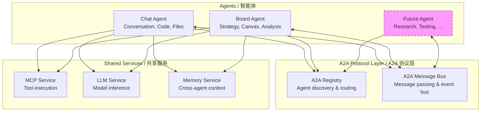
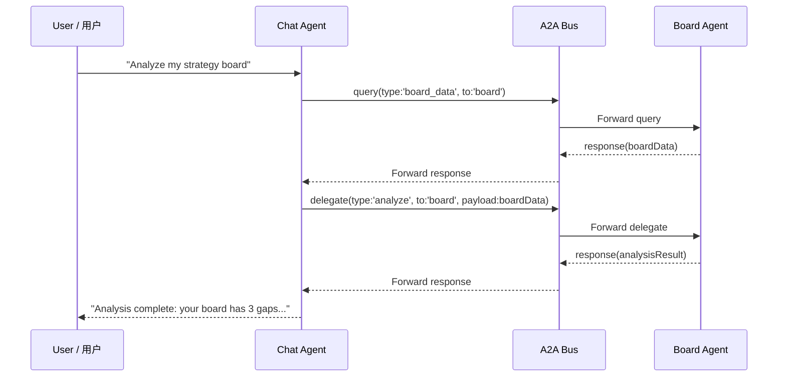
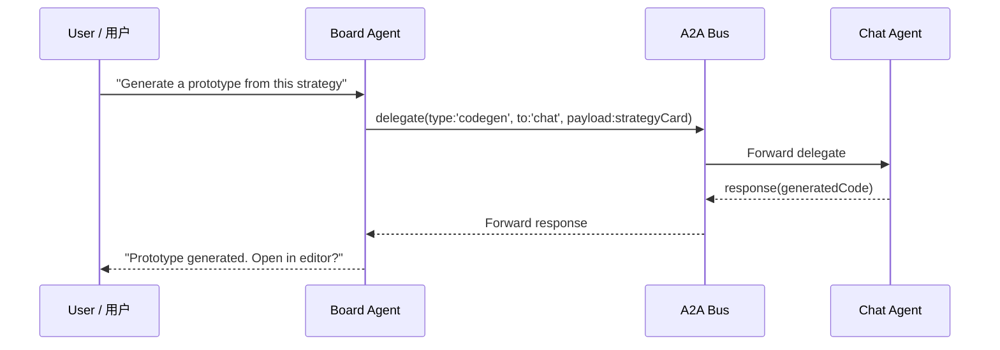
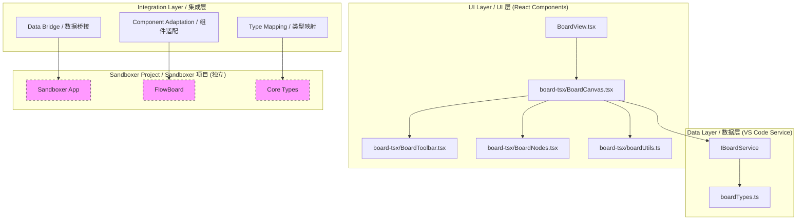

# 设计文档

> **文档性质**：本文档记录 Statuz IDE 的前瞻性设计蓝图，所有内容均标注为 **Proposed（尚未实现）**。代码库中不存在这些接口和系统的实现，它们仅作为未来开发的参考规格。

---

## A2A 智能体模式

> **Status**: Proposed / 尚未实现
> 
> 相关文件均待创建：`common/a2aTypes.ts`、`common/a2aService.ts`、`browser/chatAgent.ts`、`browser/boardAgent.ts`、`common/memoryService.ts`。

### A2A 定位与 MCP 的区别

A2A（Agent-to-Agent）是 Statuz 自研的多智能体协作协议。与 MCP（模型上下文协议，定义 AI 与**工具**的交互）不同，A2A 定义 AI 智能体之间**作为对等体**的交互方式。Statuz 自研 A2A 协议而非采用外部标准，以实现对智能体编排模型的完全控制。

关键区别：
- **MCP**：智能体 → 工具（工具执行协议）
- **A2A**：智能体 ↔ 智能体（对等协作协议）
- **Chat 智能体**：处理对话、代码生成、文件操作
- **Board 智能体**：处理策略规划、画布操作、分析
- **未来智能体**：研究、测试、部署等

### A2A 架构



### A2A 消息协议

A2A 协议定义了以下智能体间通信的消息类型：

```typescript
// A2A Message Types / A2A 消息类型
interface A2AMessage {
    id: string;
    from: AgentId;         // 'chat' | 'board' | 'research' | ...
    to: AgentId;
    type: A2AMessageType;
    payload: unknown;
    timestamp: number;
    replyTo?: string;      // ID of message being replied to
}

type A2AMessageType =
    | 'request'            // Request an action / 请求操作
    | 'response'           // Response to a request / 响应请求
    | 'event'              // State change notification / 状态变更通知
    | 'query'              // Query for information / 查询信息
    | 'delegate'           // Delegate a task / 委托任务
    | 'status'             // Status update / 状态更新

// Agent Registry / 智能体注册
interface AgentRegistration {
    id: AgentId;
    name: string;
    capabilities: string[];    // e.g., ['codegen', 'analysis', 'canvas']
    version: string;
}
```

### A2A 流程示例

**场景一：Chat 智能体委托分析给 Board 智能体**



**场景二：Board 智能体请求 Chat 智能体生成代码**



### A2A 实现计划

| 步骤 | 描述 | 文件 | 优先级 |
|------|------|------|--------|
| 1 | 定义 A2A 类型和接口 | `common/a2aTypes.ts`（待创建） | High |
| 2 | 实现 A2A 注册表 | `common/a2aService.ts`（待创建） | High |
| 3 | 实现 A2A 消息总线 | `common/a2aService.ts`（待创建） | High |
| 4 | 注册 Chat 智能体 | `browser/chatAgent.ts`（待创建） | High |
| 5 | 注册 Board 智能体 | `browser/boardAgent.ts`（待创建） | High |
| 6 | 集成到 Sidebar Tab 切换 | `react/src/sidebar-tsx/Sidebar.tsx` | Medium |
| 7 | 跨智能体内存共享 | `common/memoryService.ts`（待创建） | Medium |

---

## Board 系统设计

> **Status**: Proposed / 尚未实现
> 
> 相关文件均待创建：`common/boardServiceTypes.ts`、`common/boardTypes.ts`、`common/boardService.ts`、`board-tsx/BoardCanvas.tsx`、`board-tsx/BoardNodes.tsx`、`board-tsx/BoardToolbar.tsx`、`board-tsx/boardUtils.ts`。

### 总体架构



### IBoardService 接口定义

```typescript
// file: src/vs/workbench/contrib/statuz/common/boardServiceTypes.ts (to be created)

export interface IBoardService {
    readonly _serviceBrand: undefined;

    // Board data management / Board 数据管理
    getBoardData(): Promise<BoardData>;
    updateBoardLayout(layout: FlowNodeLayout[]): Promise<void>;
    updateBoardEdges(edges: FlowEdgeData[]): Promise<void>;

    // Card operations / 卡片操作
    addCard(card: Omit<SandboxCard, 'id'>): Promise<SandboxCard>;
    updateCard(id: string, data: Partial<SandboxCard>): Promise<void>;
    removeCard(id: string): Promise<void>;

    // AI analysis integration / AI 分析集成
    analyzeBoard(): Promise<BoardAnalysis>;
    suggestNextActions(): Promise<BoardSuggestion[]>;
    runSemanticDriftCheck(answer: string, cardType: string): Promise<DriftWarning[]>;

    // Events / 事件
    onDidChangeBoardData: Event<BoardData>;
}

export interface BoardData {
    cards: SandboxCard[];
    layout: FlowNodeLayout[];
    edges: FlowEdgeData[];
    constitution?: Constitution;
}
```

### Board 扩展点

```
BoardView (Container / 容器)
├── BoardHeader (Project selector / breadcrumb)        ← Extension Point 1
├── BoardCanvas (Main canvas area / 主画布区域)
│   ├── ReactFlow Instance
│   │   ├── CustomNodes                                  ← Extension Point 2
│   │   │   ├── CardNode (Strategy card / 策略卡)
│   │   │   ├── ConstitutionNode (Constitution / 构念)
│   │   │   ├── DecisionNode (Decision / 决策)
│   │   │   └── PlaceholderNode (Placeholder / 占位)
│   │   ├── CustomEdges                                  ← Extension Point 3
│   │   │   ├── InformsEdge
│   │   │   ├── ConstrainsEdge
│   │   │   └── ContradictsEdge
│   │   ├── MiniMap
│   │   └── Controls
│   └── BoardToolbar                                     ← Extension Point 4
│       ├── Search
│       ├── Layout toggle (column/dagre/manual)
│       ├── Zoom
│       └── AI Analysis button
├── BoardSidePanel (Detail panel / 详情面板)             ← Extension Point 5
│   ├── Card details
│   ├── Constitution preview
│   └── AI suggestions
└── BoardCommandBar (Command input / 命令输入)            ← Extension Point 6
    ├── /card command
    ├── /market-sizing command
    └── AI conversation
```

---

## Sandboxer 集成

> **Status**: Proposed / 参考用，非依赖
> 
> Sandboxer 是位于 `d:\github projects\sandboxer\` 的独立项目，Statuz IDE 不提取或复制其代码。

### 关系定位

- **Sandboxer** 是一个**独立项目**，位于 `d:\github projects\sandboxer\`，是一个完整的功能性策略规划应用，拥有自己的路由、认证和 AI 服务。它**不是** Statuz IDE 的依赖。
- **Statuz IDE** 从 Sandboxer 的 Board/FlowBoard 系统中汲取**架构灵感和核心结论**，但实现自己适配 IDE 上下文的版本。
- 两个项目独立演进——Sandboxer 是独立应用，Statuz IDE 的 Board 是 IDE 原生。

### 引用的核心结论

Statuz 仅引用以下来自 Sandboxer 的核心结论，**不提取或复制** Sandboxer 代码。

| # | 核心结论 | 描述 | Statuz 如何使用 |
|---|---------|------|----------------|
| 1 | 基于卡片的策略模型 | Strategy is represented as typed cards (vision, user, problem, mvp, roadmap) | Statuz Board will define its own `Card` type matching this model |
| 2 | 基于流程的画布布局 | Cards are connected by typed edges on a React Flow canvas | Statuz Board will use `@xyflow/react` with similar edge types |
| 3 | 通过 dagre 自动布局 | Cards are auto-positioned using topological sort and dagre layout | Statuz Board will use `@dagrejs/dagre` for the same purpose |
| 4 | 构念驱动设计 | A "Constitution" defines vision, principles, metrics, constraints | Statuz Board will support a similar Constitution entity |
| 5 | 语义漂移检测 | AI checks if answers drift from core principles / constitution | Statuz Board will implement its own drift detection via A2A |
| 6 | 完整性分析 | AI analyzes which card types are missing from the board | Statuz Board will implement its own completeness analysis |

### 项目结构参考

作为参考，以下是 Sandboxer 项目结构的简要概览。仅供了解——两个项目独立运作。

```
d:\github projects\sandboxer\     (Independent project / 独立项目)
├── src/
│   ├── App.tsx                        # Main app (routing, auth, projects)
│   ├── types.ts                       # Core type definitions (Cards, Constitution, etc.)
│   ├── components/flow/               # FlowBoard components
│   │   ├── FlowBoard.tsx              # React Flow canvas (~1018 lines)
│   │   ├── FlowBoardNodes.tsx         # Custom node renderers
│   │   ├── boardUtils.ts              # Pure utility functions
│   │   └── hooks/                     # Custom hooks
│   ├── components/workspace/          # Workspace components
│   ├── lib/ai/                        # AI service providers
│   └── lib/storage/                   # Local storage engine
├── package.json
└── ...
```

### 依赖管理

Statuz IDE 在实现 Board 时将添加以下依赖：

| 依赖 | Version | 用途 | 包体积影响 |
|------|---------|------|-----------|
| `@xyflow/react` | ^12.x | Canvas engine / 画布引擎 | ~200 KB (minified) |
| `@dagrejs/dagre` | ^3.x | Auto-layout / 自动布局 | ~50 KB (minified) |

以下 Sandboxer 的依赖**不会**添加到 Statuz：

| 依赖 | 排除原因 | 替代方案 |
|------|---------|---------|
| `lucide-react` | Statuz uses Codicon icons / 使用 VS Code 的 Codicon | Codicon / inline SVG |
| `motion` | Simple animation needs / 动画需求简单 | CSS transition |
| `zod` | Not needed for internal types / 内部类型不需要 | TypeScript types |
| `@supabase/supabase-js` | No database in Statuz / 无数据库需求 | BoardService manages data |
| `react-router-dom` | VS Code has no routing / VS Code 无路由 | Conditional rendering |
